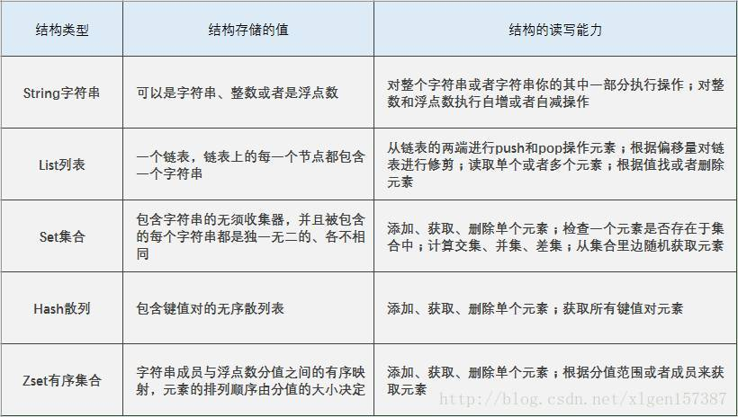
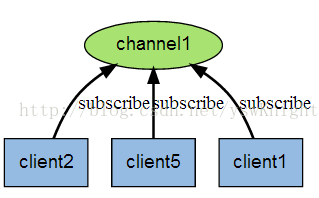
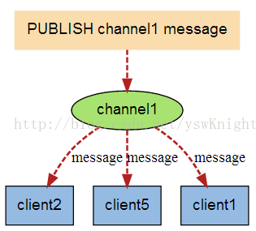

# Redis相关  

###  redis的数据类型以及日常的应用  

-  String：普通的key/value存储都可以归为此类，value其实不仅是String， 也可以是数字：比如想知道什么时候封锁一个IP地址(访问超过几次)。INCRBY命令让这些变得很容易，通过原子递增保持计数。
-  List：微博 TimeLine   消息队列
-  Set： 共同好友、二度好友，利用唯一性，可以统计访问网站的所有独立 IP，好友推荐的时候，根据 tag 求交集，大于某个 threshold 就可以推荐
-  Hash：例如存储、读取、修改用户属性（name，age，pwd等
-  ZSet：排序  

###  redis的发布/订阅的原理  
- Redis 发布订阅(pub/sub)是一种消息通信模式：发送者(pub)发送消息，订阅者(sub)接收消息。
- Redis 客户端可以订阅任意数量的频道。
- 客户端和服务端可以理解为都各自维护着一个channel通道列表。
- 下图展示了频道 channel1 ， 以及订阅这个频道的三个客户端 —— client2 、 client5 和 client1 之间的关系：



- 当有新消息通过 PUBLISH 命令发送给频道 channel1 时， 这个消息就会被发送给订阅它的三个客户端：



###  zset的底层实现  

[https://juejin.im/post/5e075c9b6fb9a0164c7bbbd7](https://juejin.im/post/5e075c9b6fb9a0164c7bbbd7)

###  数据缓存过期策略  
Redis中同时使用了惰性过期和定期过期两种过期策略。
过期策略通常有以下三种：  

- 定时过期：每个设置过期时间的key都需要创建一个定时器，到过期时间就会立即清除。该策略可以立即清除过期的数据，对内存很友好；但是会占用大量的CPU资源去处理过期的数据，从而影响缓存的响应时间和吞吐量。  
- 惰性过期：只有当访问一个key时，才会判断该key是否已过期，过期则清除。该策略可以最大化地节省CPU资源，却对内存非常不友好。极端情况可能出现大量的过期key没有再次被访问，从而不会被清除，占用大量内存。  
- 定期过期：每隔一定的时间，会扫描一定数量的数据库的expires字典中一定数量的key，并清除其中已过期的key。该策略是前两者的一个折中方案。通过调整定时扫描的时间间隔和每次扫描的限定耗时，可以在不同情况下使得CPU和内存资源达到最优的平衡效果。
(expires字典会保存所有设置了过期时间的key的过期时间数据，其中，key是指向键空间中的某个键的指针，value是该键的毫秒精度的UNIX时间戳表示的过期时间。键空间是指该Redis集群中保存的所有键。)  

###  redis的部署模式  
- standaloan(单机模式)
- ssentinel（哨兵模式）
- redis-cluster(集群模式)

###  redis为什么速度比较快  
- 完全基于内存，绝大部分请求是纯粹的内存操作，非常快速。数据存在内存中，类似于HashMap，HashMap的优势就是查找和操作的时间复杂度都是O(1)；
- 数据结构简单，对数据操作也简单，Redis中的数据结构是专门进行设计的；
- 采用单线程，避免了不必要的上下文切换和竞争条件，也不存在多进程或者多线程导致的切换而消耗 CPU，不用去考虑各种锁的问题，不存在加锁释放锁操作，没有因为可能出现死锁而导致的性能消耗；
- 使用多路I/O复用模型，非阻塞IO；
- 使用底层模型不同，它们之间底层实现方式以及与客户端之间通信的应用协议不一样，Redis直接自己构建了VM 机制 ，因为一般的系统调用系统函数的话，会浪费一定的时间去移动和请求；

FQA：
		1、多路 I/O 复用模型：多路I/O复用模型是利用 select、poll、epoll 可以同时监察多个流的 I/O 事件的能力，在空闲的时候，会把当前线程阻塞掉，当有一个或多个流有 I/O 事件时，就从阻塞态中唤醒，于是程序就会轮询一遍所有的流（epoll 是只轮询那些真正发出了事件的流），并且只依次顺序的处理就绪的流，这种做法就避免了大量的无用操作。
		2、单线程：CPU不是Redis的瓶颈，Redis的瓶颈最有可能是机器内存的大小或者网络带宽。


###  reids的大key、热key的处理  
hot key: 
-  使用本地缓存
-  利用分片算法的特性，对key进行打散处理


```
//redis 实例数
const M = 16
//redis 实例数倍数（按需设计，2^n倍，n一般为1到4的整数）
const N = 2
func main() {
//获取 redis 实例 
    c, err := redis.Dial("tcp", "127.0.0.1:6379")
    if err != nil {
        fmt.Println("Connect to redis error", err)
        return
    }
    defer c.Close()

    hotKey := "hotKey:abc"
    //随机数
    randNum := GenerateRangeNum(1, N*M)
    //得到对 hot key 进行打散的 key
    tmpHotKey := hotKey + "_" + strconv.Itoa(randNum)

    //hot key 过期时间
    expireTime := 50

    //过期时间平缓化的一个时间随机值
    randExpireTime := GenerateRangeNum(0, 5)

    data, err := redis.String(c.Do("GET", tmpHotKey))
    if err != nil {
        data, err = redis.String(c.Do("GET", hotKey))
        if err != nil {
            data = GetDataFromDb()
            c.Do("SET", "hotKey", data, expireTime)
            c.Do("SET", tmpHotKey, data, expireTime + randExpireTime)
        } else {
            c.Do("SET", tmpHotKey, data, expireTime + randExpireTime)
        }
    }
}


作者：Akay
链接：https://juejin.im/post/5c19be51f265da615c593351
```

big key:
-  对 big key 进行拆分

###  如何实现分布式锁的  
链接：http://xiaorui.cc/archives/3028


```
package main
import (
	"fmt"
	"log"
	"time"

	"github.com/garyburd/redigo/redis"
)

type Lock struct {
	resource string
	token    string
	conn     redis.Conn
	timeout  int
}

func (lock *Lock) tryLock() (ok bool, err error) {
	_, err = redis.String(lock.conn.Do("SET", lock.key(), lock.token, "EX", int(lock.timeout), "NX"))
	if err == redis.ErrNil {
		// The lock was not successful, it already exists.
		return false, nil
	}
	if err != nil {
		return false, err
	}
	return true, nil
}

func (lock *Lock) Unlock() (err error) {
	_, err = lock.conn.Do("del", lock.key())
	return
}

func (lock *Lock) key() string {
	return fmt.Sprintf("redislock:%s", lock.resource)
}

func (lock *Lock) AddTimeout(ex_time int64) (ok bool, err error) {
	ttl_time, err := redis.Int64(lock.conn.Do("TTL", lock.key()))
	fmt.Println(ttl_time)
	if err != nil {
		log.Fatal("redis get failed:", err)
	}
	if ttl_time > 0 {
		fmt.Println(11)
		_, err := redis.String(lock.conn.Do("SET", lock.key(), lock.token, "EX", int(ttl_time+ex_time)))
		if err == redis.ErrNil {
			return false, nil
		}
		if err != nil {
			return false, err
		}
	}
	return false, nil
}

func TryLock(conn redis.Conn, resource string, token string, DefaulTimeout int) (lock *Lock, ok bool, err error) {
	return TryLockWithTimeout(conn, resource, token, DefaulTimeout)
}

func TryLockWithTimeout(conn redis.Conn, resource string, token string, timeout int) (lock *Lock, ok bool, err error) {
	lock = &Lock{resource, token, conn, timeout}

	ok, err = lock.tryLock()

	if !ok || err != nil {
		lock = nil
	}

	return
}

func main() {
	fmt.Println("start")
	DefaultTimeout := 10
	conn, err := redis.Dial("tcp", "localhost:6379")

	lock, ok, err := TryLock(conn, "xiaoru.cc", "token", int(DefaultTimeout))
	if err != nil {
		log.Fatal("Error while attempting lock")
	}
	if !ok {
		log.Fatal("Lock")
	}
	lock.AddTimeout(100)

	time.Sleep(time.Duration(DefaultTimeout) * time.Second)
	fmt.Println("end")
	defer lock.Unlock()
}
```

###  持久化策略及其对比  
RDB（快照）和 AOF（追加式）

RDB持久化方式会在一个特定的间隔保存那个时间点的一个数据快照。


AOF持久化方式则会记录每一个服务器收到的写操作。在服务启动时，这些记录的操作会逐条执行从而重建出原来的数据。写操作命令记录会以追加的方式进行保存。


两种方式的持久化是可以同时存在的，但是当Redis重启时，AOF文件会被优先用于重建数据。

作者：浅蓝色的麻吉
链接：https://juejin.im/post/5dcfc66ae51d453af47ce6f9

###  缓存雪崩、缓存击穿、缓存穿透  
- 缓存雪崩:  当某一时刻发生大规模的缓存失效的情况，比如你的缓存服务宕机了，会有大量的请求进来直接打到DB上面。结果就是DB 称不住，挂掉。
- 缓存击穿:  在平常高并发的系统中，大量的请求同时查询一个 key 时，此时这个key正好失效了，就会导致大量的请求都打到数据库上面去。这种现象我们称为缓存击穿。
- 缓存穿透:  那么请求去查询一条压根儿数据库中根本就不存在的数据，也就是缓存和数据库都查询不到这条数据，但是请求每次都会打到数据库上面去。


